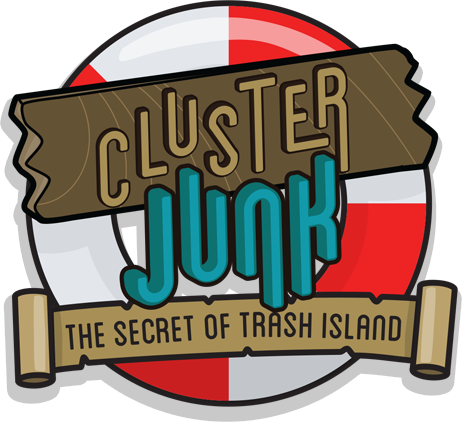

A sample starter game using [splat-ecs](https://github.com/SplatJS/splat-ecs)

# Get started

1. Fork this repo & clone it to your computer
2. Install [Node.js](https://nodejs.org)
3. Run `npm install` inside the project folder
4. Run `npm run build` inside the project folder
5. Open build/index.html in your browser
